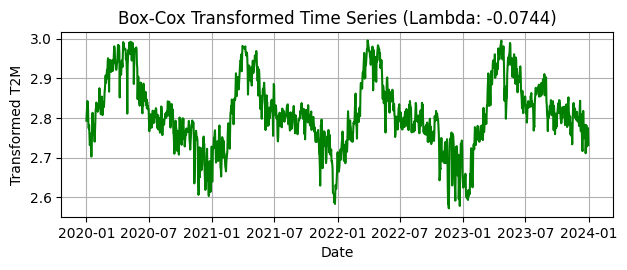

ARIMA for Weather Forecast of Karnataka Districts using NASA Power Data

Data Source: https://power.larc.nasa.gov/

The data was extracted using REST API with latitude, longitude and respective parameter values

<div>
<style scoped>
    .dataframe tbody tr th:only-of-type {
        vertical-align: middle;
    }

    .dataframe tbody tr th {
        vertical-align: top;
    }

    .dataframe thead th {
        text-align: right;
    }
</style>
<table border="1" class="dataframe">
  <thead>
    <tr style="text-align: right;">
      <th></th>
      <th>Year</th>
      <th>DayOfYear</th>
      <th>T2M</th>
      <th>WS2M</th>
      <th>PRECTOTCORR</th>
      <th>RH2M</th>
      <th>ALLSKY_SFC_SW_DWN</th>
      <th>T2M_MIN</th>
      <th>T2M_MAX</th>
      <th>PS</th>
    </tr>
  </thead>
  <tbody>
    <tr>
      <th>0</th>
      <td>2020</td>
      <td>1</td>
      <td>22.90</td>
      <td>2.45</td>
      <td>0.05</td>
      <td>74.44</td>
      <td>12.02</td>
      <td>18.30</td>
      <td>29.42</td>
      <td>92.01</td>
    </tr>
    <tr>
      <th>1</th>
      <td>2020</td>
      <td>2</td>
      <td>23.45</td>
      <td>2.33</td>
      <td>0.00</td>
      <td>73.00</td>
      <td>14.78</td>
      <td>18.70</td>
      <td>29.94</td>
      <td>92.09</td>
    </tr>
    <tr>
      <th>2</th>
      <td>2020</td>
      <td>3</td>
      <td>23.88</td>
      <td>1.84</td>
      <td>0.00</td>
      <td>72.00</td>
      <td>18.09</td>
      <td>18.42</td>
      <td>30.83</td>
      <td>92.01</td>
    </tr>
    <tr>
      <th>3</th>
      <td>2020</td>
      <td>4</td>
      <td>24.38</td>
      <td>1.39</td>
      <td>0.00</td>
      <td>72.06</td>
      <td>17.15</td>
      <td>19.20</td>
      <td>30.59</td>
      <td>91.85</td>
    </tr>
    <tr>
      <th>4</th>
      <td>2020</td>
      <td>5</td>
      <td>24.15</td>
      <td>1.85</td>
      <td>0.00</td>
      <td>74.19</td>
      <td>16.97</td>
      <td>19.69</td>
      <td>30.87</td>
      <td>91.83</td>
    </tr>
  </tbody>
</table>
</div>


Description: This represents the daily average air temperature measured at 2 meters above the ground.
Unit: Degrees Celsius (°C).
Use Case: This is one of the most common weather parameters and is essential for understanding 

<br>
2. WS2M (Wind Speed at 2 Meters)
Description: This is the average daily wind speed measured at 2 meters above the ground.
Unit: Meters per second (m/s). Use Case: Wind speed data is critical for evaluating wind
energy potential and understanding its influence on climate, transportation, and agriculture.
Wind affects the rate of evaporation, and higher wind speeds can increase the cooling effect
4 on crops<br>
3. PRECTOTCORR (Precipitation Corrected)
Description: This is the total daily precipitation, which includes all forms of liquid and
solid water (rain, snow, hail) falling to the surface. The value is corrected to account for
inconsistencies in precipitation measurement. Unit: Millimeters (mm) per day. Use Case:
Precipitation is essential for water resource management, agriculture, flood risk assessment,
and climate studies. Understanding how much water is available helps plan irrigation and
anticipate flooding or drought conditions.<br>
4. RH2M (Relative Humidity at 2 Meters)
Description: This is the average daily relative humidity measured at 2 meters above the
ground. Relative humidity is the amount of moisture in the air compared to the maximum
amount of moisture the air can hold at that temperature. Unit: Percentage (%). Use Case:
Relative humidity is important for comfort, agricultural planning, and understanding evaporation
and plant transpiration rates. High humidity levels can increase the risk of fungal
diseases in crops.<br>
5. ALLSKY_SFC_SW_DWN (All Sky Surface Shortwave Downward Irradiance)
Description: This measures the total solar radiation (shortwave) that reaches the Earth’s surface
under all sky conditions (including clear and cloudy skies). It represents the amount of
sunlight that hits the ground. Unit: Kilowatt-hours per square meter per day (kWh/m²/day).
Use Case: Solar radiation data is essential for evaluating the potential for solar energy generation,
as well as its effect on agriculture, ecosystems, and climate studies.<br>
6. T2M_MIN (Minimum Temperature at 2 Meters)
Description: This is the daily minimum air temperature measured at 2 meters above the
ground. It reflects the coldest point in the day, typically during the early morning hours.
Unit: Degrees Celsius (°C). Use Case: Minimum temperature data is important for evaluating
frost risk in agriculture, especially for crops sensitive to cold conditions. It also helps in
understanding daily temperature variability and trends.<br>
7. T2M_MAX (Maximum Temperature at 2 Meters)
Description: This is the daily maximum air temperature measured at 2 meters above the
ground. It reflects the hottest point in the day, typically during the afternoon. Unit: Degrees
Celsius (°C). Use Case: Maximum temperature data is critical for heat stress evaluation,
especially in agriculture and public health. High temperatures can stress crops and livestock
and can impact human comfort and energy consumption for cooling.<br>
8. PS (Surface Pressure)
Description: This is the daily surface pressure, which is the atmospheric pressure exerted
by the weight of the atmosphere at the Earth’s surface. Surface pressure is a key indicator
of weather patterns. Unit: Pascals (Pa). Use Case: Surface pressure is used in weather
forecasting and understanding large-scale atmospheric circulation patterns. Changes in surface
pressure are often associated with weather fronts, storms, and other significant weather
events.<br>
Summary of Units:
5
T2M: °C (Degrees Celsius) — Average air temperature at 2 meters.<br>
WS2M: m/s (Meters per second) — Wind speed at 2 meters.<br>
PRECTOTCORR: mm/day (Millimeters per day) — Total precipitation.<br>
RH2M: % (Percentage) — Relative humidity at 2 meters.<br>
ALLSKY_SFC_SW_DWN: kWh/m²/day (Kilowatt-hours per square meter per day) —
Solar radiation.<br>
T2M_MIN: °C — Minimum air temperature at 2 meters.<br>
T2M_MAX: °C — Maximum air temperature at 2 meters.<br>
PS: Pa (Pascals) — Surface pressure.


<div>
<style scoped>
    .dataframe tbody tr th:only-of-type {
        vertical-align: middle;
    }

    .dataframe tbody tr th {
        vertical-align: top;
    }

    .dataframe thead th {
        text-align: right;
    }
</style>
<table border="1" class="dataframe">
  <thead>
    <tr style="text-align: right;">
      <th></th>
      <th>Year</th>
      <th>DayOfYear</th>
      <th>T2M</th>
      <th>WS2M</th>
      <th>PRECTOTCORR</th>
      <th>RH2M</th>
      <th>ALLSKY_SFC_SW_DWN</th>
      <th>T2M_MIN</th>
      <th>T2M_MAX</th>
      <th>PS</th>
      <th>Date</th>
    </tr>
  </thead>
  <tbody>
    <tr>
      <th>0</th>
      <td>2020</td>
      <td>1</td>
      <td>22.90</td>
      <td>2.45</td>
      <td>0.05</td>
      <td>74.44</td>
      <td>12.02</td>
      <td>18.30</td>
      <td>29.42</td>
      <td>92.01</td>
      <td>2020-01-01</td>
    </tr>
    <tr>
      <th>1</th>
      <td>2020</td>
      <td>2</td>
      <td>23.45</td>
      <td>2.33</td>
      <td>0.00</td>
      <td>73.00</td>
      <td>14.78</td>
      <td>18.70</td>
      <td>29.94</td>
      <td>92.09</td>
      <td>2020-01-02</td>
    </tr>
    <tr>
      <th>2</th>
      <td>2020</td>
      <td>3</td>
      <td>23.88</td>
      <td>1.84</td>
      <td>0.00</td>
      <td>72.00</td>
      <td>18.09</td>
      <td>18.42</td>
      <td>30.83</td>
      <td>92.01</td>
      <td>2020-01-03</td>
    </tr>
    <tr>
      <th>3</th>
      <td>2020</td>
      <td>4</td>
      <td>24.38</td>
      <td>1.39</td>
      <td>0.00</td>
      <td>72.06</td>
      <td>17.15</td>
      <td>19.20</td>
      <td>30.59</td>
      <td>91.85</td>
      <td>2020-01-04</td>
    </tr>
    <tr>
      <th>4</th>
      <td>2020</td>
      <td>5</td>
      <td>24.15</td>
      <td>1.85</td>
      <td>0.00</td>
      <td>74.19</td>
      <td>16.97</td>
      <td>19.69</td>
      <td>30.87</td>
      <td>91.83</td>
      <td>2020-01-05</td>
    </tr>
  </tbody>
</table>
</div>


    <class 'pandas.core.frame.DataFrame'>
    RangeIndex: 1461 entries, 0 to 1460
    Data columns (total 11 columns):
     #   Column             Non-Null Count  Dtype         
    ---  ------             --------------  -----         
     0   Year               1461 non-null   int64         
     1   DayOfYear          1461 non-null   int64         
     2   T2M                1461 non-null   float64       
     3   WS2M               1461 non-null   float64       
     4   PRECTOTCORR        1461 non-null   float64       
     5   RH2M               1461 non-null   float64       
     6   ALLSKY_SFC_SW_DWN  1461 non-null   float64       
     7   T2M_MIN            1461 non-null   float64       
     8   T2M_MAX            1461 non-null   float64       
     9   PS                 1461 non-null   float64       
     10  Date               1461 non-null   datetime64[ns]
    dtypes: datetime64[ns](1), float64(8), int64(2)
    memory usage: 125.7 KB


    Year                 False
    DayOfYear            False
    T2M                  False
    WS2M                 False
    PRECTOTCORR          False
    RH2M                 False
    ALLSKY_SFC_SW_DWN    False
    T2M_MIN              False
    T2M_MAX              False
    PS                   False
    Date                 False
    dtype: bool

    

    


We plot the box plots of all the columns to visualise the outliers. We will treat these outliers in the next step. 


    


    

    


Calculate Quartiles:

    Q1 (First Quartile): The value below which 25% of the data falls.
    Q3 (Third Quartile): The value below which 75% of the data falls.
    

Compute the IQR:

    IQR (Interquartile Range): The difference between Q3 and Q1, representing the middle 50% of the data.
    Calculate it as:


Determine Bounds for Outliers:

    Calculate the lower and upper bounds for outliers:
        Lower Bound: Q1−1.5×IQRQ1−1.5×IQR
        Upper Bound: Q3+1.5×IQRQ3+1.5×IQR

Identify Outliers:

    Use these bounds to filter the DataFrame and identify outliers:


Count Outliers:

    Count the number of outliers by checking the shape of the filtered DataFrame:

Display Results:

    Print the number of outliers and the actual outlier values to review:


This method helps to identify extreme values in your dataset that might affect statistical analysis or modeling.


    Number of outliers: 27
          Year  DayOfYear    T2M  WS2M  PRECTOTCORR   RH2M  ALLSKY_SFC_SW_DWN  \
    108   2020        109  29.79  3.60         0.00  45.44              24.00   
    112   2020        113  29.84  2.43         0.00  46.25              23.98   
    113   2020        114  30.20  2.07         1.45  47.31              23.44   
    124   2020        125  29.79  2.20         0.06  49.50              25.13   
    135   2020        136  30.03  2.56         0.00  40.00              22.69   
    136   2020        137  30.25  2.88         0.00  40.31              18.60   
    143   2020        144  30.62  1.73         0.00  42.06              22.11   
    144   2020        145  30.83  2.38         4.31  46.00              23.65   
    355   2020        356  17.20  2.46         0.00  81.94              20.94   
    455   2021         90  30.69  2.48         0.00  29.81              23.62   
    458   2021         93  30.67  1.73         0.00  31.44              24.85   
    459   2021         94  30.10  2.55         0.15  32.12              22.75   
    460   2021         95  30.06  2.83         0.15  38.94              22.63   
    718   2021        353  17.08  2.28         0.00  79.38              19.50   
    719   2021        354  17.15  2.05         0.00  81.44              20.21   
    819   2022         89  30.01  2.28         0.02  40.19              20.72   
    820   2022         90  30.15  2.48         0.00  38.38              21.83   
    821   2022         91  29.91  2.96         0.10  38.44              19.16   
    849   2022        119  29.94  3.25         0.01  47.88              24.15   
    850   2022        120  29.98  1.91         0.64  49.94              23.69   
    851   2022        121  30.31  1.52         9.84  52.38              21.10   
    1055  2022        325  16.92  1.69         0.03  87.69              19.78   
    1072  2022        342  17.31  2.05         0.03  77.62              13.15   
    1105  2023         10  16.62  2.28         0.00  75.00              22.12   
    1106  2023         11  17.17  1.61         0.00  71.12              22.63   
    1205  2023        110  30.24  1.52         0.00  35.00              25.37   
    1206  2023        111  30.16  1.96         0.36  41.31              23.41   
    
          T2M_MIN  T2M_MAX     PS       Date  
    108     21.81    37.98  91.72 2020-04-18  
    112     21.46    36.80  91.66 2020-04-22  
    113     24.62    36.12  91.65 2020-04-23  
    124     23.27    37.13  91.67 2020-05-04  
    135     23.07    38.69  91.34 2020-05-15  
    136     22.62    37.23  91.29 2020-05-16  
    143     22.06    38.35  91.40 2020-05-23  
    144     25.48    36.89  91.47 2020-05-24  
    355     12.16    24.57  91.95 2020-12-21  
    455     22.25    39.26  91.35 2021-03-31  
    458     21.77    38.29  91.41 2021-04-03  
    459     23.51    37.14  91.58 2021-04-04  
    460     22.09    37.83  91.60 2021-04-05  
    718     12.23    24.41  92.10 2021-12-19  
    719     11.75    24.60  92.09 2021-12-20  
    819     22.36    37.13  91.58 2022-03-30  
    820     24.14    36.48  91.62 2022-03-31  
    821     23.26    37.55  91.61 2022-04-01  
    849     21.28    38.47  91.57 2022-04-29  
    850     22.56    37.18  91.46 2022-04-30  
    851     23.54    36.89  91.35 2022-05-01  
    1055    12.89    20.69  91.69 2022-11-21  
    1072    13.00    22.83  91.65 2022-12-08  
    1105     9.22    25.49  92.12 2023-01-10  
    1106    11.01    26.19  91.98 2023-01-11  
    1205    21.45    38.02  91.35 2023-04-20  
    1206    23.79    36.55  91.35 2023-04-21  
    

After Outlier Treatment


    

    

The Augmented Dickey-Fuller (ADF) test is a statistical test used to determine whether a given time series is stationary or non-stationary. Stationarity means that the statistical properties of the time series, such as the mean, variance, and autocorrelation, remain constant over time.
Hypotheses of the ADF Test:

    Null Hypothesis (H₀): The time series has a unit root (i.e., the series is non-stationary).

    Alternate Hypothesis (H₁): The time series does not have a unit root (i.e., the series is stationary).
    

p-value: If the p-value is less than a chosen significance level (e.g., 0.05), you reject the null hypothesis (H₀) and conclude that the time series is stationary.
ADF Statistic: Compare the ADF statistic with the critical values. If the ADF statistic is less than the critical value, you can reject the null hypothesis and conclude the series is stationary.


    -3.05481318293526
    0.030083017930734077
    


    {'1%': -3.434944046599697,
     '5%': -2.863568954302161,
     '10%': -2.5678502032578696}


We can conclude that the time series is stationary, thus no differencing is required

Now we want to see if the variance changes with time, for this we plot rolling std deviation and check if variance is changing with or is constant.

    

    


Since it is not really constant, we now apply the box cox transformation to stablise the variance. We can use log transformation if the variance increases with time. Box cox only works on postive values, so we have to check that or else we have to shift the values by some constant. Here it is not required


    

    


Now, lets plot this and check if the variance improved


    

    


Much Better Variance! Lets go ahead and plot the Auto correlation function and Partial Auto correlation

    

    


Explanation:

    ACF Plot: Helps identify the number of significant lags that are correlated with the time series. This is useful for determining the "moving average" (MA) part of an ARIMA model.
    PACF Plot: Helps determine the number of significant lags after controlling for the intermediate lags. This is useful for identifying the "autoregressive" (AR) part of an ARIMA model.


From this we see that there is no cut off in ACF so we have to difference this as this might be non stationary.

Since PACF cuts off after lag 1, it is an Auto regressive process of order 1. Thus p = 1


                                   SARIMAX Results                                
    ==============================================================================
    Dep. Variable:             BoxCox_T2M   No. Observations:                 1434
    Model:                 ARIMA(1, 0, 1)   Log Likelihood                3200.569
    Date:                Sun, 22 Sep 2024   AIC                          -6393.137
    Time:                        21:29:31   BIC                          -6372.065
    Sample:                             0   HQIC                         -6385.269
                                   - 1434                                         
    Covariance Type:                  opg                                         
    ==============================================================================
                     coef    std err          z      P>|z|      [0.025      0.975]
    ------------------------------------------------------------------------------
    const          2.8091      0.015    182.082      0.000       2.779       2.839
    ar.L1          0.9540      0.007    131.222      0.000       0.940       0.968
    ma.L1         -0.0164      0.021     -0.774      0.439      -0.058       0.025
    sigma2         0.0007   1.88e-05     35.749      0.000       0.001       0.001
    ===================================================================================
    Ljung-Box (L1) (Q):                   0.00   Jarque-Bera (JB):               192.17
    Prob(Q):                              0.99   Prob(JB):                         0.00
    Heteroskedasticity (H):               1.01   Skew:                            -0.23
    Prob(H) (two-sided):                  0.87   Kurtosis:                         4.73
    ===================================================================================
    
    Warnings:
    [1] Covariance matrix calculated using the outer product of gradients (complex-step).
    


<div>
<style scoped>
    .dataframe tbody tr th:only-of-type {
        vertical-align: middle;
    }

    .dataframe tbody tr th {
        vertical-align: top;
    }

    .dataframe thead th {
        text-align: right;
    }
</style>
<table border="1" class="dataframe">
  <thead>
    <tr style="text-align: right;">
      <th></th>
      <th>Year</th>
      <th>DayOfYear</th>
      <th>T2M</th>
      <th>WS2M</th>
      <th>PRECTOTCORR</th>
      <th>RH2M</th>
      <th>ALLSKY_SFC_SW_DWN</th>
      <th>T2M_MIN</th>
      <th>T2M_MAX</th>
      <th>PS</th>
      <th>Date</th>
      <th>Rolling_Std</th>
      <th>BoxCox_T2M</th>
    </tr>
  </thead>
  <tbody>
    <tr>
      <th>1456</th>
      <td>2023</td>
      <td>361</td>
      <td>21.10</td>
      <td>2.91</td>
      <td>0.00</td>
      <td>65.56</td>
      <td>21.80</td>
      <td>14.73</td>
      <td>30.94</td>
      <td>92.13</td>
      <td>2023-12-27</td>
      <td>0.033932</td>
      <td>2.728071</td>
    </tr>
    <tr>
      <th>1457</th>
      <td>2023</td>
      <td>362</td>
      <td>21.80</td>
      <td>3.22</td>
      <td>0.00</td>
      <td>71.75</td>
      <td>16.84</td>
      <td>14.37</td>
      <td>30.77</td>
      <td>92.07</td>
      <td>2023-12-28</td>
      <td>0.033329</td>
      <td>2.754051</td>
    </tr>
    <tr>
      <th>1458</th>
      <td>2023</td>
      <td>363</td>
      <td>22.38</td>
      <td>3.19</td>
      <td>0.00</td>
      <td>71.94</td>
      <td>12.71</td>
      <td>16.45</td>
      <td>30.48</td>
      <td>92.08</td>
      <td>2023-12-29</td>
      <td>0.033040</td>
      <td>2.774907</td>
    </tr>
    <tr>
      <th>1459</th>
      <td>2023</td>
      <td>364</td>
      <td>22.30</td>
      <td>2.88</td>
      <td>0.01</td>
      <td>64.81</td>
      <td>18.64</td>
      <td>16.81</td>
      <td>31.10</td>
      <td>92.02</td>
      <td>2023-12-30</td>
      <td>0.032876</td>
      <td>2.772065</td>
    </tr>
    <tr>
      <th>1460</th>
      <td>2023</td>
      <td>365</td>
      <td>21.19</td>
      <td>2.71</td>
      <td>0.00</td>
      <td>64.81</td>
      <td>19.00</td>
      <td>14.89</td>
      <td>30.64</td>
      <td>92.00</td>
      <td>2023-12-31</td>
      <td>0.033379</td>
      <td>2.731463</td>
    </tr>
  </tbody>
</table>
</div>


```python
forecast_index = pd.date_range(start=df["Date"].iloc[-1] + pd.Timedelta(days=1), periods=30)
forecast_index
```


    DatetimeIndex(['2024-01-01', '2024-01-02', '2024-01-03', '2024-01-04',
                   '2024-01-05', '2024-01-06', '2024-01-07', '2024-01-08',
                   '2024-01-09', '2024-01-10', '2024-01-11', '2024-01-12',
                   '2024-01-13', '2024-01-14', '2024-01-15', '2024-01-16',
                   '2024-01-17', '2024-01-18', '2024-01-19', '2024-01-20',
                   '2024-01-21', '2024-01-22', '2024-01-23', '2024-01-24',
                   '2024-01-25', '2024-01-26', '2024-01-27', '2024-01-28',
                   '2024-01-29', '2024-01-30'],
                  dtype='datetime64[ns]', freq='D')


```python
new_df = df[['Date', 'T2M']]
```


```python
f_pd = pd.DataFrame({"Date":list(forecast_index), "T2M": list(forecast_original)})
```


```python
new_df = new_df.append(f_pd, ignore_index=True)
```


```python
new_df.tail()
```


<div>
<style scoped>
    .dataframe tbody tr th:only-of-type {
        vertical-align: middle;
    }

    .dataframe tbody tr th {
        vertical-align: top;
    }

    .dataframe thead th {
        text-align: right;
    }
</style>
<table border="1" class="dataframe">
  <thead>
    <tr style="text-align: right;">
      <th></th>
      <th>Date</th>
      <th>T2M</th>
    </tr>
  </thead>
  <tbody>
    <tr>
      <th>1459</th>
      <td>2024-01-26</td>
      <td>22.707040</td>
    </tr>
    <tr>
      <th>1460</th>
      <td>2024-01-27</td>
      <td>22.736857</td>
    </tr>
    <tr>
      <th>1461</th>
      <td>2024-01-28</td>
      <td>22.765343</td>
    </tr>
    <tr>
      <th>1462</th>
      <td>2024-01-29</td>
      <td>22.792556</td>
    </tr>
    <tr>
      <th>1463</th>
      <td>2024-01-30</td>
      <td>22.818551</td>
    </tr>
  </tbody>
</table>
</div>


```python
plt.figure(figsize=(12, 6))
plt.subplot(2, 1, 2)
plt.plot(new_df['Date'], new_df['T2M'], label='Time Series', color='green')

# Highlight the last 10 points
last_10 = new_df.tail(30)
plt.plot(last_10['Date'], last_10['T2M'], label='Last 30 Points', color='red', marker='.')

# Title and labels
plt.title(f'Time Series of T2M from {new_df["Date"].min()} to {new_df["Date"].max()}')
plt.xlabel('Date')
plt.ylabel('T2M')
plt.grid(True)

# Legend
plt.legend()

# Adjust layout and show
plt.tight_layout()
plt.show()
```


    

    


Now that we have made the forecast for 30 days lets take real data for 2024 and compare our error values


```python
import requests
# Define the district and its coordinates
district = "Bangalore"
coords = {"lat": 12.9716, "lon": 77.5946}
# Date range
start_date = "20240101"
end_date = "20240130"
# List of parameters to check
parameters = ["T2M", "WS2M", "PRECTOTCORR", "RH2M", "ALLSKY_SFC_SW_DWN","T2M_MIN", "T2M_MAX", "PS"]
# NASA POWER API URL template
url_template = "https://power.larc.nasa.gov/api/temporal/daily/point?parameters={param}&community=AG&longitude={lon}&latitude={lat}&start={start}&end={end}"
param = "T2M"
url = url_template.format(param=param, lon=coords["lon"], lat=coords["lat"],start=start_date, end=end_date)
# Send the API request
response = requests.get(url)
# Print the first 10 lines of the response text (raw response including headers)
if response.status_code == 200:
    # Split response text by lines
    response_lines = response.text.splitlines()
    # Print the first 10 lines for debugging
    print(f"Raw API response for parameter '{param}':\n")
    for i, line in enumerate(response_lines[:50]):
        print(f"Line {i+1}: {line}")
else:
    print(f"Failed to fetch data. Status code: {response.status_code}")
```

    Raw API response for parameter 'T2M':
    
    Line 1: {"type":"Feature","geometry":{"type":"Point","coordinates":[77.5946,12.9716,841.72]},"properties":{"parameter":{"T2M":{"20240101":21.79,"20240102":22.42,"20240103":22.27,"20240104":21.31,"20240105":22.83,"20240106":22.68,"20240107":22.06,"20240108":22.07,"20240109":21.83,"20240110":22.03,"20240111":22.2,"20240112":21.92,"20240113":23.11,"20240114":23.01,"20240115":22.65,"20240116":22.47,"20240117":22.65,"20240118":22.87,"20240119":23.26,"20240120":24.37,"20240121":24.3,"20240122":24.69,"20240123":24.01,"20240124":24.67,"20240125":24.33,"20240126":23.48,"20240127":23.4,"20240128":23.36,"20240129":23.32,"20240130":23.19}}},"header":{"title":"NASA/POWER CERES/MERRA2 Native Resolution Daily Data","api":{"version":"v2.5.9","name":"POWER Daily API"},"sources":["merra2"],"fill_value":-999.0,"start":"20240101","end":"20240130"},"messages":[],"parameters":{"T2M":{"units":"C","longname":"Temperature at 2 Meters"}},"times":{"data":1.197,"process":0.1}}
    


```python
d = {"type":"Feature","geometry":{"type":"Point","coordinates":[77.5946,12.9716,841.72]},"properties":{"parameter":{"T2M":{"20240101":21.79,"20240102":22.42,"20240103":22.27,"20240104":21.31,"20240105":22.83,"20240106":22.68,"20240107":22.06,"20240108":22.07,"20240109":21.83,"20240110":22.03,"20240111":22.2,"20240112":21.92,"20240113":23.11,"20240114":23.01,"20240115":22.65,"20240116":22.47,"20240117":22.65,"20240118":22.87,"20240119":23.26,"20240120":24.37,"20240121":24.3,"20240122":24.69,"20240123":24.01,"20240124":24.67,"20240125":24.33,"20240126":23.48,"20240127":23.4,"20240128":23.36,"20240129":23.32,"20240130":23.19}}},"header":{"title":"NASA/POWER CERES/MERRA2 Native Resolution Daily Data","api":{"version":"v2.5.9","name":"POWER Daily API"},"sources":["merra2"],"fill_value":-999.0,"start":"20240101","end":"20240130"},"messages":[],"parameters":{"T2M":{"units":"C","longname":"Temperature at 2 Meters"}},"times":{"data":1.289,"process":0.11}}
```


```python
d["properties"]["parameter"]["T2M"].values()
```


    dict_values([21.79, 22.42, 22.27, 21.31, 22.83, 22.68, 22.06, 22.07, 21.83, 22.03, 22.2, 21.92, 23.11, 23.01, 22.65, 22.47, 22.65, 22.87, 23.26, 24.37, 24.3, 24.69, 24.01, 24.67, 24.33, 23.48, 23.4, 23.36, 23.32, 23.19])


```python

x_test_df = pd.DataFrame({"Date":forecast_index, "T2M": list(d["properties"]["parameter"]["T2M"].values())})
```


```python
plt.figure(figsize=(30, 6))
plt.plot(new_df['Date'], new_df['T2M'], label='Time Series', color='green')

# Highlight the last 10 points
last_10 = new_df.tail(30)
plt.plot(last_10['Date'], last_10['T2M'], label='Forecasted Mean Temp', color='red', marker='.')

plt.plot(x_test_df['Date'], x_test_df['T2M'], label='Actual Mean Temp', color='blue', marker='.')

# Title and labels
plt.title(f'Time Series of T2M from {new_df["Date"].min()} to {new_df["Date"].max()}')
plt.xlabel('Date')
plt.ylabel('T2M')
plt.grid(True)

# Legend
plt.legend()

# Adjust layout and show

plt.show()
```


    

    


```python

```


```python

```
